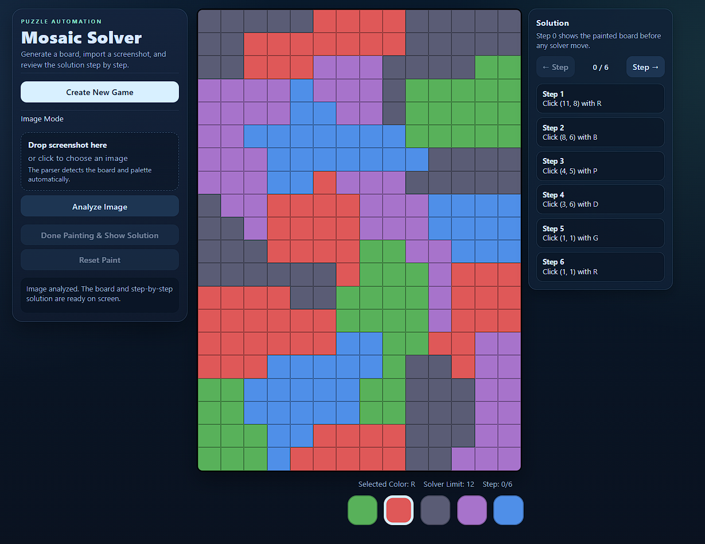

# Mosaic Solver App

Mosaic Solver App is a local web app for generating, analyzing, and solving Mosaic-style color boards. It includes a manual board editor, step-by-step solution playback, and screenshot analysis through a Flask backend.

## Highlights

- Generate a new puzzle board with custom rows, columns, colors, and solver limit.
- Paint the board manually and review the solver path step by step.
- Import screenshots for automatic board detection and palette recognition.
- Validate crop and palette before final analysis.

## Screenshot



## Project Structure

- `page.html` - app shell, controls, and preview modal
- `style.css` - layout and visual styling
- `logic.js` - front-end interaction, solver, and image workflow
- `server.py` - Flask backend for image analysis
- `requirements.txt` - Python dependencies
- `Screenshot.png` - repository preview image

## Usage

### Run locally

1. Create and activate a Python virtual environment.
2. Install dependencies:

```powershell
pip install -r requirements.txt
```

3. Start the backend:

```powershell
python server.py
```

4. Open the app in your browser:

```text
http://127.0.0.1:5000
```

### Image workflow

1. Drag and drop a screenshot or click the upload area to choose one.
2. Review the detected crop and palette in the preview window.
3. Adjust the crop if needed, then confirm analysis.
4. Review the parsed board and the generated solution guide.

## Notes

- Screenshot analysis runs locally through the Flask backend.
- Local environment folders such as `.venv/` are ignored by Git.

## Repository Name

This repository is intended to be published on GitHub as `Mosaic-Solver-App`.
